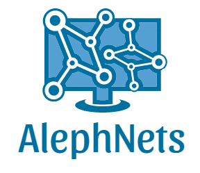

  

---

- **Autor@s:** 
- **Licencia de Uso:** MIT.
- **Email:** 
- **Google Site:** 
- **Linkedin:** 
---

La librería AlephNets consiste en un conjunto de algoritmos que implementan distintos modelos de redes neuronales.
